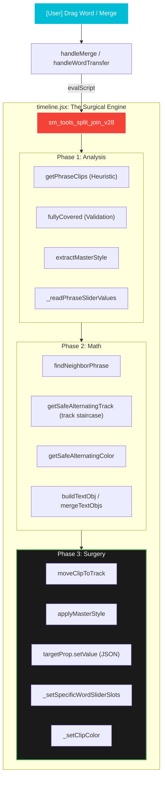
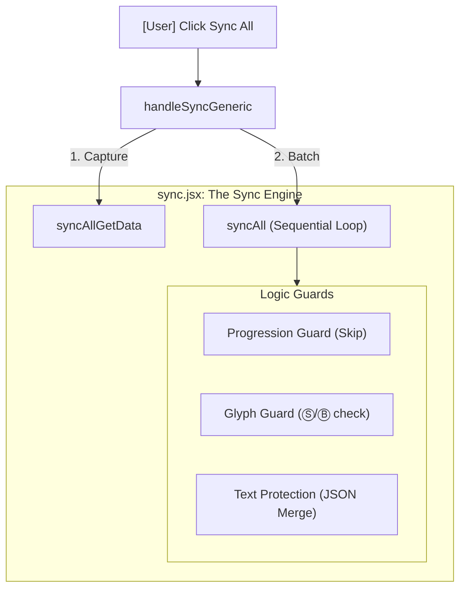
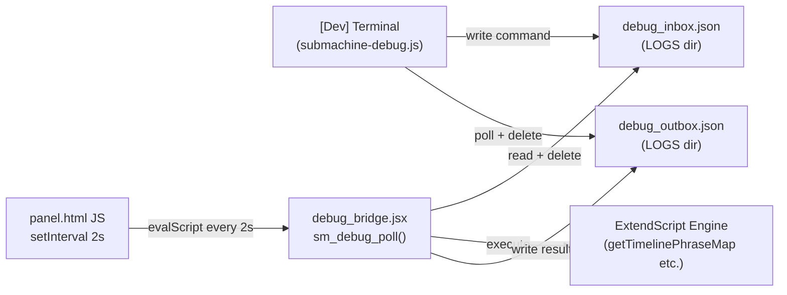

# Visual Execution Dashboard: High-Density Logic Map

This document provides a **Granular Trace** of SubMachine's execution. Each branch shows not just the entry point, but every internal helper function that must fire to complete the user's request.

## 1. Word Surgery Flow (High Density)
This is the most complex flow in the plugin, involving word remapping, track movement, and style preservation.

## 2. Sync Engine Flow (High Density)
How styles are copied while protecting text content.

---

### Glossary of Nodes
*   **Heuristic (`getPhraseClips`)**: The "Brain" that finds all clips belonging to the same sentence. **Note: scans a single track only** — clips spread across tracks by a previous staircase operation will not be found by this function.
*   **Staircase (`getSafeAlternatingTrack`)**: Logic that ensures phrases don't overlap on the same track. Picks from pool [1,2,3] avoiding the two neighbour track indices. Does not check occupancy.
*   **JSON Envelope (`mergeTextObjs`)**: The safe way to copy styles without overwriting word content.
*   **Gap Bridge (`_bridgeGaps`)**: Extends each clip's end to exactly meet the next clip's start (ticks-based), eliminating frame-snap gaps that cause subtitle flickering.

---

## 3. Debug Bridge Flow

How the terminal debugger communicates with ExtendScript inside Premiere Pro.

**Zero overhead guarantee**: `sm_debug_poll()` checks for `debug_inbox.json` existence as its first operation. If the file is absent (i.e., no command pending) it returns immediately — the 2s heartbeat costs one `File.exists` check per tick.
